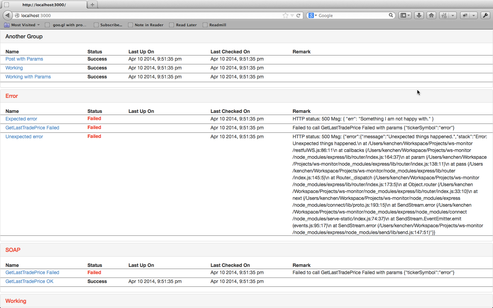

## Introduction

This is a lightweight application to help monitoring RESTful and/or SOAP WS.  
The registered WS are constantly checked in given interval _(by default 10 mins)_.  
The status of registered WS can be grouped and shown in browser with realtime update without refresh _(taking advantage of WebSocket)_.



## How to run

Start the server
```
$ node index.js
```

Check registered WS status through
`http://localhost:3000`

## How to configure and register WS to monitor

* Modify the configuration in _config.js_
* Modify the RESTful / SOAP ws in _restWS.js_ and _soapWS.js_

## Restful WS structure

Restful WS are actually grouped into one object.  Key is the WS name and value is an object contains all the setting.

* `url`: mandatory
* `params`: optional
* `validator`: optional.  It enables easy customization on verifying WS response
* `groups`: mandatory.  It helps grouping related WS together into meaningful unit.

```javascript
{
'Working with Params': {
    url: config.restServerHost + 'rest/workingWithParams',
    params: {
      foo: 'bar'
    },
    validator: function(data) {
      var obj = JSON.parse(data);
      if (!obj.foo && obj.foo !== 'bar') {
        return false;
      }
      return true;
    },
    groups: ['Working', 'Another Group']
  }
}
```

## SOAP WS structure

SOAP WS is a little bit different from the RESTful one.  One WSDL is supposed to be defined as one service object and endpoints are grouped under it.

* `url`: mandatory
* `name`: mandatory
* `endpoints`: mandatory.  It's an object with key to be endpoint name and value to be endpoint setting.
  1. `method`: mandatory.  SOAP endpoint operation
  2. `criteria`: optional.
  3. `validator`: optional.  It enables easy customization on verifying WS response
  4. `groups`: mandatory.  It helps grouping related WS together into meaningful unit.

```javascript
[{
    url: config.soapServerHost + 'stockquote?wsdl',
    name: 'Stock Quote',
    endPoints: {
      'GetLastTradePrice OK': {
        method: 'GetLastTradePrice',
        criteria: { tickerSymbol: 'AAPL'},
        validator: function(result) {
          if (!result.price) {
            return false;
          }
          return true;
        },
        groups: ['SOAP', 'Working']
      },
      'GetLastTradePrice Failed': {
        method: 'GetLastTradePrice',
        criteria: { tickerSymbol: 'error'},
        groups: ['SOAP', 'Error']
      }
    }
}]
```

## License

(The MIT License)

Copyright (c) 2009-2013 Ken Chen <chengusky@gmail.com>

Permission is hereby granted, free of charge, to any person obtaining
a copy of this software and associated documentation files (the
'Software'), to deal in the Software without restriction, including
without limitation the rights to use, copy, modify, merge, publish,
distribute, sublicense, and/or sell copies of the Software, and to
permit persons to whom the Software is furnished to do so, subject to
the following conditions:

The above copyright notice and this permission notice shall be
included in all copies or substantial portions of the Software.

THE SOFTWARE IS PROVIDED 'AS IS', WITHOUT WARRANTY OF ANY KIND,
EXPRESS OR IMPLIED, INCLUDING BUT NOT LIMITED TO THE WARRANTIES OF
MERCHANTABILITY, FITNESS FOR A PARTICULAR PURPOSE AND NONINFRINGEMENT.
IN NO EVENT SHALL THE AUTHORS OR COPYRIGHT HOLDERS BE LIABLE FOR ANY
CLAIM, DAMAGES OR OTHER LIABILITY, WHETHER IN AN ACTION OF CONTRACT,
TORT OR OTHERWISE, ARISING FROM, OUT OF OR IN CONNECTION WITH THE
SOFTWARE OR THE USE OR OTHER DEALINGS IN THE SOFTWARE.
